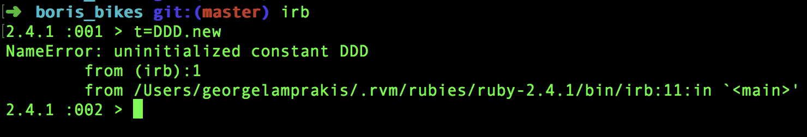

# Challenge 4

This picture shows the error message stack trace for an unsuccessfull attempt to instantiate an object from a class that hasn't yet been defined. 

### Type of error
[NameError](http://ruby-doc.org/core-2.2.0/NameError.html) from the documentation 
> Raised when a given name is invalid or undefined.
### Filepath
/Users/georgelamprakis/.rvm/rubies/ruby-2.4.1/bin/irb:11:in `<main>`
 - is where our computer has stored irb. IRB is a Read Evaluate Print Loop. The error was triggered by irb because there wasn't a class named DDD defined.

 ### Line Error
 As we can see from the stack trace in the screenshot above the error was caused by line 1 and line 11.

 ### Documentation

 [NameError](http://ruby-doc.org/core-2.2.0/NameError.html) from the documentation found under Exceptions

 ### Solving the error
 Identify the error by following the stack trace and trying to find it on the very top entry which will lead us to a line of code that we need to analyse. In our current example we found the phrase Uninitialized Constant DDD, which showed us that DDD was not yet defined. 